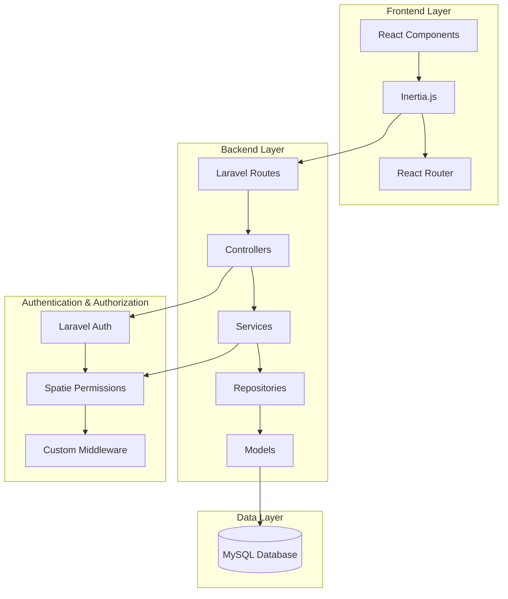
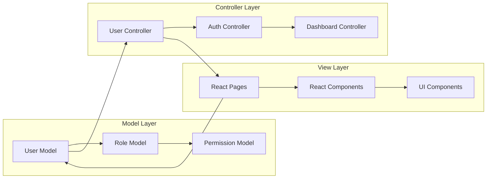
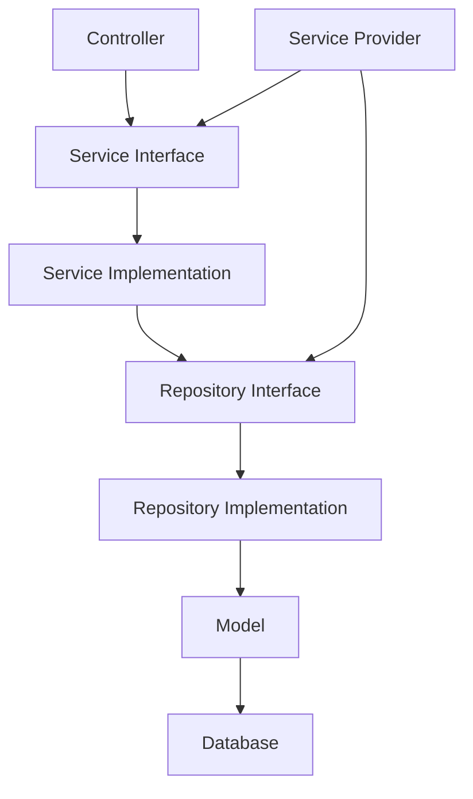
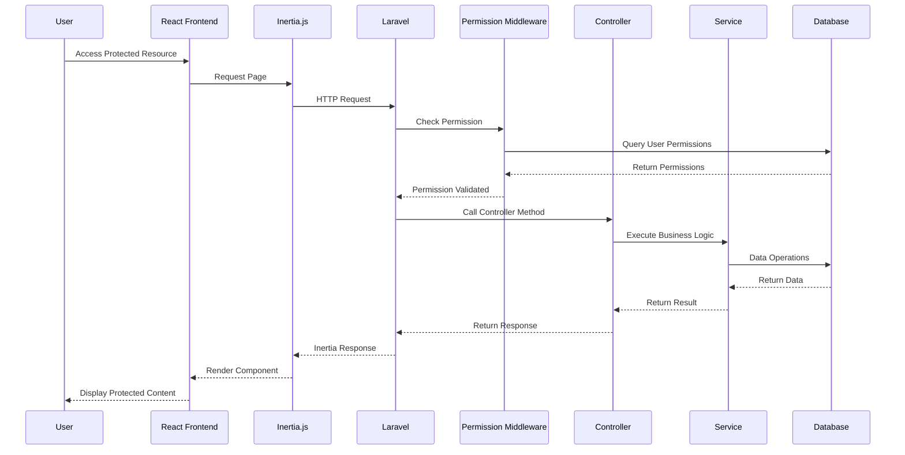
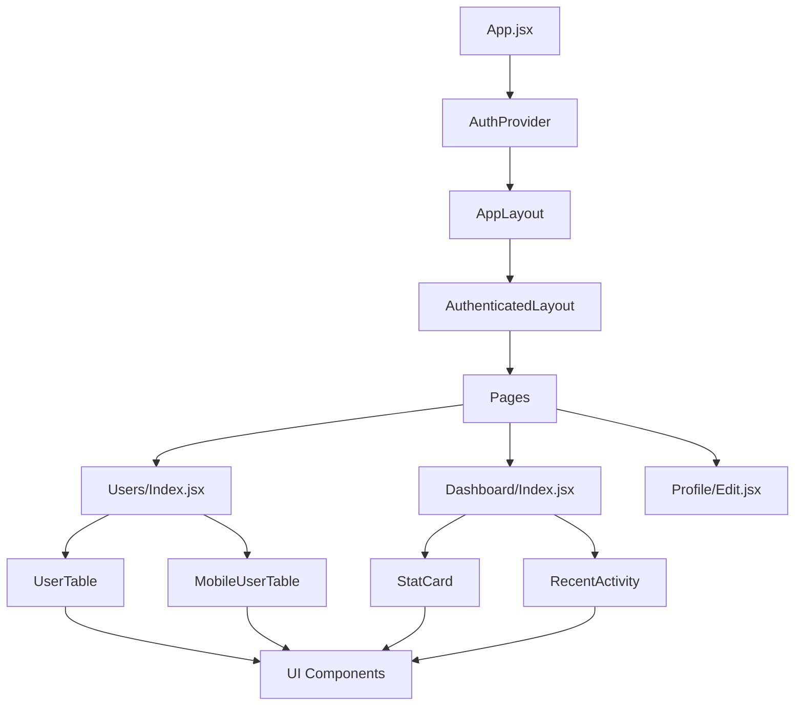
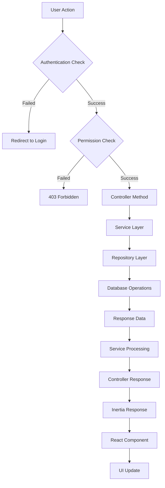
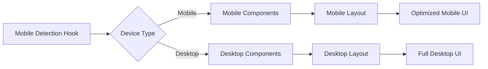
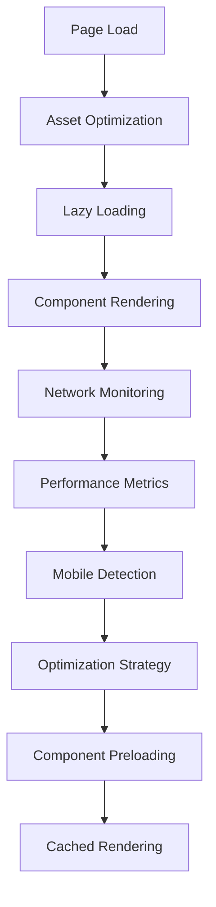

# Diagram Arsitektur StockTrackApp

## 1. High-Level Architecture Overview



## 2. MVC Architecture Pattern



## 3. Repository & Service Pattern



## 4. Role-Based Access Control Flow



## 5. Frontend Component Hierarchy



## 6. Database Schema for User Management

```mermaid
erDiagram
    users {
        uuid id PK
        string name
        string email
        string password
        uuid current_role_id FK
        boolean is_active
        timestamp last_login_at
        timestamp email_verified_at
        timestamps
    }
    
    roles {
        uuid id PK
        string name
        string guard_name
        timestamps
    }
    
    permissions {
        uuid id PK
        string name
        string guard_name
        timestamps
    }
    
    model_has_roles {
        uuid role_id FK
        string model_type
        uuid model_id FK
    }
    
    model_has_permissions {
        uuid permission_id FK
        string model_type
        uuid model_id FK
    }
    
    role_has_permissions {
        uuid permission_id FK
        uuid role_id FK
    }
    
    users ||--o{ model_has_roles : "has"
    roles ||--o{ model_has_roles : "belongs to"
    users ||--o{ model_has_permissions : "has"
    permissions ||--o{ model_has_permissions : "belongs to"
    roles ||--o{ role_has_permissions : "has"
    permissions ||--o{ role_has_permissions : "belongs to"
    users }o--|| roles : "current_role"
```

## 7. Request Flow for User Management



## 8. Mobile-First Responsive Architecture



## 9. Performance Optimization Flow



## 10. Security Architecture

```mermaid
graph TD
    A[User Request] --> B[CSRF Protection]
    B --> C[Authentication Middleware]
    C --> D[Session Validation]
    D --> E[Permission Middleware]
    E --> F[Input Validation]
    F --> G[Business Logic]
    G --> H[Authorization Check]
    H --> I[Data Access]
    I --> J[Audit Logging]
    J --> K[Response]
